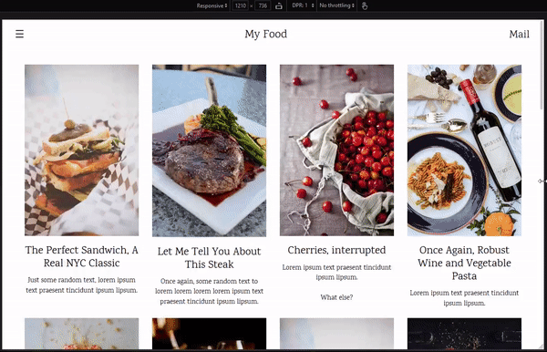
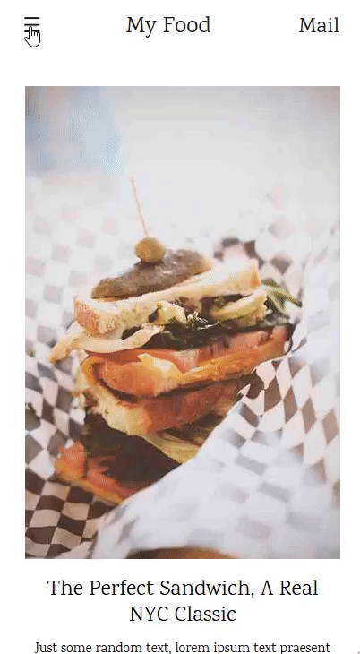
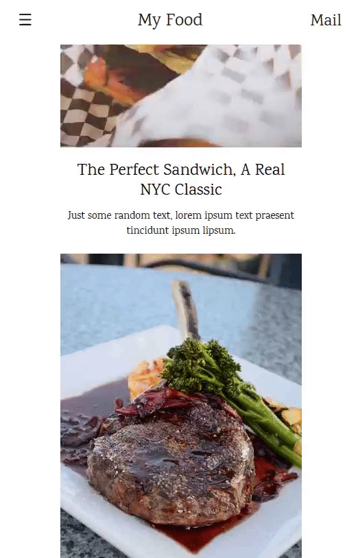
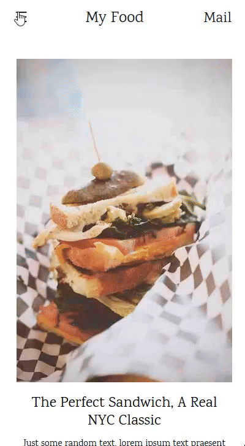

# My Food Web Project

This is my first web project using Bootstrap technology. This web page was based on one of the W3Schools free templates available.

## About

My Food is my personal project created to apply my Bootstrap knowledge.

### Tecnologies envolved
HTML 5, CSS 3, Bootstrap 4 and JQuery.

### Website My Food
URL: https://tiagocbarbosa.github.io/myFood_web/html/index.html

### Characteristics

* It is responsive:  

  <kbd>

* It has navbar mobile menu... even on mobile viewport:  

  <kbd>

* The navbar is fixed on the top:  

  <kbd>

* The navbar nav links redirects the page to the Food and About section:  

  <kbd>

* "Mail" and "tiagocbarbosa" (a A html tag in the botton of the page) will send the user to my GitHub profile.

------

Made by Tiago Barbosa. <a href="https://www.linkedin.com/in/tiagocastrobarbosa">Get in touch!</a>
